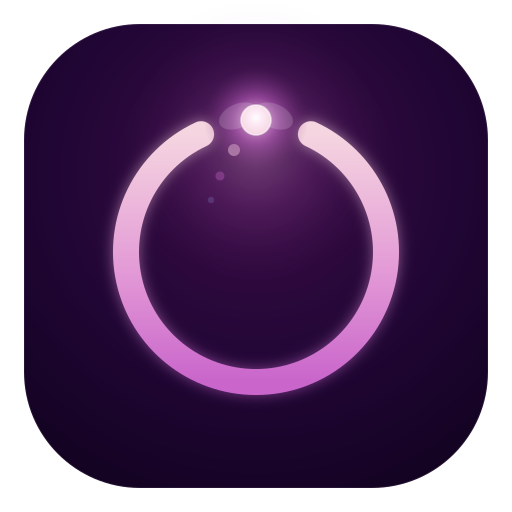

  

# Firefly Focus — Pomodoro Timer & Tasks

> A calm, private Pomodoro timer for Chrome. A draggable floating widget follows you across tabs, tasks can have deadlines, gentle fireflies drift over the timer, and three hand-tuned themes keep it easy on the eyes. Everything stays on your device — no accounts, no tracking, no network.

<!-- Add real captures to docs/screenshots/ and update these paths before publishing. -->

  
  
  

---

## ✨ Features

- **Classic Pomodoro cycles** — focus, short break and long break, with configurable durations and auto-continue.
- **Floating widget on any page** — a draggable, transparent widget that keeps the timer and your top tasks visible while you work. Move it anywhere, or close it with one click.
- **Full side panel** — the complete UI in Chrome's native side panel: timer, tasks, daily stats and settings.
- **Tasks with deadlines** — add an optional due date to any task. Overdue tasks are flagged in red, tasks due soon in amber. Your tasks persist across days and restarts — pick up unfinished work the next morning.
- **Firefly animation** — continuous, softly glowing fireflies drift over the widget and panel. Their colour follows the active theme and mode.
- **Three themes** — **Midnight** (dark), **Daylight** (light) and **Sage** (calm green), each with its own tasteful accent palette.
- **Warm sound signals** — four expressive, non-harsh sound styles (Bright, Arcade, Bell, Soft) for stage changes and reminders.
- **Desktop notifications** — start/stop alerts plus a configurable "almost done" reminder.
- **Daily stats & goal** — sessions completed today, focus time and progress toward your daily goal.
- **7 interface languages** — English, Ukrainian, German, Spanish, Italian, Slovak and Czech, switchable on the fly.
- **Private by design** — 100% local storage, no sign-in, no analytics, no external requests.

---

## 📦 Install

### From the Chrome Web Store
> _Store link coming soon._

### Manual (load unpacked)
1. Download or clone this repository.
2. Open `chrome://extensions` in Chrome (or any Chromium browser, v116+).
3. Enable **Developer mode** (top-right).
4. Click **Load unpacked** and select the project folder.
5. Pin the extension and click its icon to open the side panel.

---

## 🚀 Usage

- **Open the panel** — click the toolbar icon to open the side panel with the full timer, tasks and settings.
- **Floating widget** — appears automatically on regular web pages (`http`/`https`). Drag it by the header, click the body to open the panel, or press **×** to hide it on the current page (it comes back on reload). To turn it off everywhere, use **Settings → Floating widget on websites**.
- **Add a deadline** — click the date pill under a task to set or change its due date; clear the date to remove it.
- **Switch theme / language** — both selectors live at the top of the side panel.
- **Tune it** — set focus/break lengths, long-break cadence, reminder time, daily goal, sound style and firefly frequency in **Settings**.

> Note: like all Chrome extensions, the floating widget cannot run on browser system pages (`chrome://…`, the Web Store, the New Tab page). Open a normal website to see it.

---

## 🔒 Privacy

Firefly Focus stores your timer state, tasks, settings and statistics **locally** using `chrome.storage.local`. Nothing is sent anywhere — there are no accounts, no analytics and no network requests. See [PRIVACY.md](PRIVACY.md) for the full policy.

---

## 🔑 Permissions

| Permission | Why it's needed |
|---|---|
| `alarms` | Fire the timer's end and pre-end reminder even when the panel is closed. |
| `storage` | Save your timer state, tasks, settings and daily stats on your device. |
| `notifications` | Show desktop alerts when a focus or break stage starts or ends. |
| `offscreen` | Play the short completion/reminder sounds via the Web Audio API (a service worker can't play audio on its own). |
| `sidePanel` | Show the full timer UI in Chrome's side panel. |
| Host access (`http://*/*`, `https://*/*`) | Inject the optional floating widget onto web pages so the timer stays visible. **No page content is read, modified or transmitted.** |

---

## 🧩 Project structure

| File | Role |
|---|---|
| `manifest.json` | MV3 manifest, permissions and entry points. |
| `service_worker.js` | Background logic: timer state, alarms, cycles, stats, tasks, settings. |
| `sidepanel.html` / `sidepanel.css` / `sidepanel.js` | The full side-panel UI. |
| `floating_widget.js` | The draggable in-page widget (Shadow DOM content script). |
| `offscreen.html` / `offscreen.js` | Web Audio sound synthesis for signals. |
| `icon128.png` | Extension icon. |

---

## 🛠️ Tech

- **Manifest V3**, no build step — plain HTML/CSS/JavaScript.
- **Shadow DOM** isolates the floating widget from host-page styles.
- **Web Audio API** synthesises all sounds (no audio files shipped).
- **CSS custom properties** power the theming and firefly palettes.
- Zero third-party dependencies.

---

## 📄 License

Released under the [MIT License](LICENSE).
